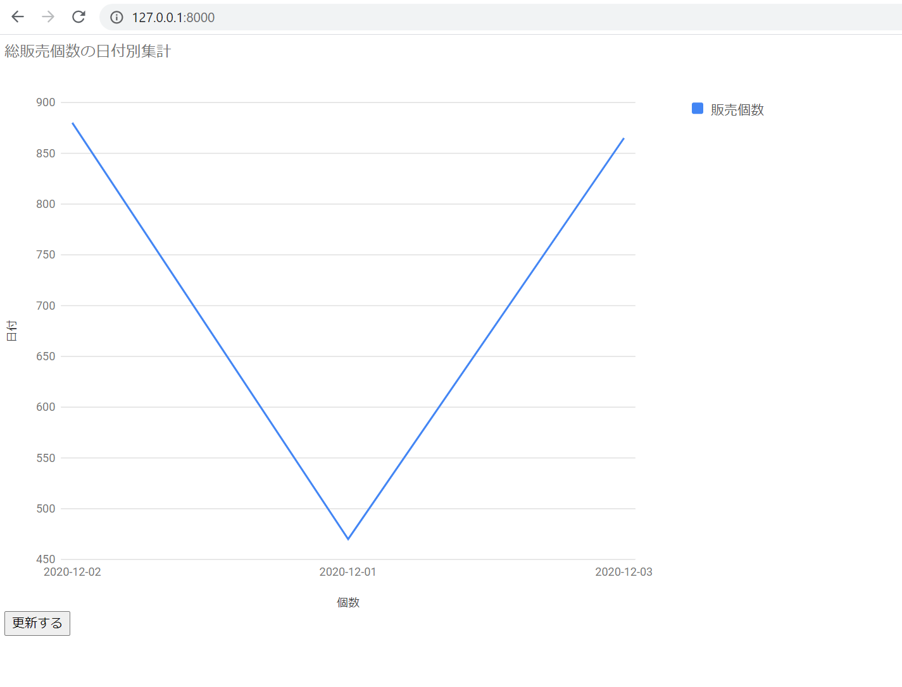

# agg_google_chart
djangoによる集計作業とGoogle chartによる可視化(非同期処理)

| ID  | 商品名  |
| ---- | ---- |
|  1  |  ぶどう  |
|  2  |  りんご  |
|  3  |  みかん  |

| ID  | 日付  | 商品ID  | 販売個数 |
|---- | ---- | ---- | ---- |
| 1 |  2020/12/1  |  1 | 200 |
| 2 |  2020/12/1  |  2 | 160 |
| 3 |  2020/12/1  |  3 | 110 |
| 4 |  2020/12/2  |  1 | 300 |
| 5 |  2020/12/2  |  3 | 470 |
| 6 |  2020/12/2  |  2 | 110 |
| 7 |  2020/12/3  |  3 | 215 |
| 8 |  2020/12/3  |  2 | 100 |
| 9 |  2020/12/3  |  1 | 550 |

・上記のレコードに対して、日付別に集計を行う(総販売個数)  
・djangoをページ表示とAPI処理(JSON応答を返す)に利用したSPAのスタイルで構築  

## コードの概要
##### date形式のannotate
・Date型から文字列の型に変形する(後のJSON化のため)  
※検索後のobjectに対し文字列変換する方法も取れるが、annotateによりテーブルにdate_str列を追加する方法をとった。

`Product_Log.objects.all().annotate(**set_date_annotate("date"))`

##### group化と、グループ内の合計を算出
・date_strの値でグループ化して、その中のamount列を参照して合計している。  
`qs.values("date_str").annotate(models.Sum("amount")))`

#### google chartに組み込める形に変形
・google chartが求める形式が以下  
`{
  "cols": [
    {
      "label": "日付",
      "type": "string"
    },
    {
      "label": "販売個数",
      "type": "number"
    }
  ],
  "rows": [
    {
      "c": [
        {
          "v": "2020-12-02"
        },
        {
          "v": 880
        }
      ]
    },
    {
      "c": [
        {
          "v": "2020-12-01"
        },
        {
          "v": 470
        }
      ]
    },
    {
      "c": [
        {
          "v": "2020-12-03"
        },
        {
          "v": 865
        }
      ]
    }
  ]
}`
  
・テーブルから取得したデータが以下  
`[{'date_str': '2020-12-02', 'amount__sum': 880}, {'date_str': '2020-12-01', 'amount__sum': 470}, {'date_str': '2020-12-03', 'amount__sum': 865}]`

・まず"rows"キーに対応するvalueを作る。(テーブルから取得したデータに対し高階関数を適用)  
※高階関数は配列の各要素に対し同じ処理を施し、形を変形できる。(for文より圧倒的に早い)  
`agg_data = list(map(transform_format, agg_data))`  

・上記でrowsキーに対応した部分が完成するので、後はcolsキーに対応した部分を作ったらOK

#### JSON化
`json.dumps(agg_format_data, ensure_ascii=False)`  
・日本語を含む場合にはensure_ascii=Falseにするらしい。

#### 完成形

